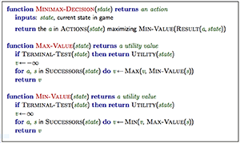

# Rapport de projet d'intelligence artificielle - Hasami Shogi - 2015/2016

## Équipe
**BÉGUEY Maud et
MONVILLE Pierre-François**    
Étudiants en troisième année à Paris Descartes

## Installation
Vous pouvez directement lancer l'executable dans le dossier launcher si vous êtes sur windows.    
Sinon le .jar dans le launcher sur toutes les plateformes.    
Vous pouvez aussi importer le projet sous eclipse et le lancer à partir de celui-ci.

## Règles:

### Aperçu: 
Le hasami Shogi est une des variations les plus populaires du Shogi au Japon.
Le mot *"hasami"* signifie *"pince"* en rapport avec la technique de prise en tenaille utilisée dans ce jeu.
Le jeu se déroule sur un plateau de cases 9x9.

### But du jeu:
Chaque joueur doit essayer de capturer les pièces adverses en déplaçant les siennes.
Le joueur à qui il reste deux pièces ou moins perd la partie.

### Déplacement:
Un joueur ne peut déplacer qu'un pion durant son tour. Les pièces peuvent être déplacées dans une direction à la fois vers le bas, le haut, la gauche ou la droite. 
Le nombre de cases pouvant être franchies par un pion pendant un déplacement n'est pas limité, cependant on ne peut sauter par dessus un de ses pions ou ceux de son adversaire. Ainsi le déplacement d'un pion ressemble à celui de la tour aux échecs. *(fig1)*.     
    

|                    |                    |                      |                      |                      |                      |                      |
| :-:                | :-:                | :-:                  | :-:                  | :-:                  | :-:                  | :-:                  |
| :heavy_minus_sign: | :heavy_minus_sign: | :heavy_minus_sign:   | :white_small_square: | :heavy_minus_sign:   | :heavy_minus_sign:   | :heavy_minus_sign:   |
| :heavy_minus_sign: | :heavy_minus_sign: | :heavy_minus_sign:   | :white_small_square: | :heavy_minus_sign:   | :heavy_minus_sign:   | :heavy_minus_sign:   |
| :heavy_minus_sign: | :black_circle:     | :white_small_square: | :white_circle:       | :white_small_square: | :white_circle: | :heavy_minus_sign: |
| :heavy_minus_sign: | :heavy_minus_sign: | :heavy_minus_sign:   | :white_small_square: | :heavy_minus_sign:   | :heavy_minus_sign:   | :heavy_minus_sign:   |
| :heavy_minus_sign: | :heavy_minus_sign: | :heavy_minus_sign:   | :white_small_square: | :heavy_minus_sign:   | :heavy_minus_sign:   | :heavy_minus_sign:   |

*figure 1*

Un joueur doit obligatoirement déplacer un pion par tour. 
S'il se voit dans l’incapacité de bouger ses pièces*(fig2)* alors il doit passer.

|                    |                    |                    |                    |                    |                    |
| :-:                | :-:                | :-:                | :-:                | :-:                | :-:                |
| :heavy_minus_sign: | :heavy_minus_sign: | :heavy_minus_sign: | :heavy_minus_sign: | :heavy_minus_sign: | :heavy_minus_sign: |
| :black_circle:     | :heavy_minus_sign: | :heavy_minus_sign: | :heavy_minus_sign: | :heavy_minus_sign: | :heavy_minus_sign: |
| :white_circle:     | :black_circle:     | :black_circle:     | :heavy_minus_sign: | :heavy_minus_sign: | :heavy_minus_sign: |
| :white_circle:     | :white_circle:     | :white_circle:     | :black_circle:     | :black_circle:     | :heavy_minus_sign: |
| :white_circle:     | :white_circle:     | :white_circle:     | :white_circle:     | :white_circle:     | :black_circle:     |

*figure 2*

### Capture des pièces
Un joueur **A** peut capturer une pièce adverse si il la prend en tenaille, 
c'est à dire si la pièce du joueur **B** voit ses cases immédiatement à gauche et à droite*(fig3)* (ou en haut et en bas*(fig4)*)) occupées par le joueur **A**. 
De même un joueur peut capturer une suite de pions adverses si ceux-ci sont consécutifs et voient leurs extrémités prises*(fig5)*
Enfin une pièce dans un coin peut être capturée si ses deux cases adjacentes sont occupées par un pion adverse*(fig6)*.
Cependant deux pièces ou plus dans un coin sont incapturables.

> note:
> on ne peut perdre un de ses pions durant son tour.
> Ainsi, déplacer son pion entre deux pions adverses ne résulte pas en une capture    

|                    |                    |                    |                    |                    |
| :-:                | :-:                | :-:                | :-:                | :-:                |
| :heavy_minus_sign: | :heavy_minus_sign: | :heavy_minus_sign: | :heavy_minus_sign: | :heavy_minus_sign: |
| :heavy_minus_sign: | :black_circle:     | :white_circle:     | :black_circle:     | :heavy_minus_sign: |
| :heavy_minus_sign: | :heavy_minus_sign: | :heavy_minus_sign: | :heavy_minus_sign: | :heavy_minus_sign: |

*figure 3*

|                    |                    |                    |
| :-:                | :-:                | :-:                |
| :heavy_minus_sign: | :heavy_minus_sign: | :heavy_minus_sign: |
| :heavy_minus_sign: | :black_circle:     | :heavy_minus_sign: |
| :heavy_minus_sign: | :white_circle:     | :heavy_minus_sign: |
| :heavy_minus_sign: | :black_circle:     | :heavy_minus_sign: |
| :heavy_minus_sign: | :heavy_minus_sign: | :heavy_minus_sign: |

*figure 4*

|                    |                    |                    |                    |                    |                    |
| :-:                | :-:                | :-:                | :-:                | :-:                | :-:                |
| :heavy_minus_sign: | :heavy_minus_sign: | :heavy_minus_sign: | :heavy_minus_sign: | :heavy_minus_sign: | :heavy_minus_sign: |
| :heavy_minus_sign: | :black_circle:     | :white_circle:     | :white_circle:     | :black_circle:     | :heavy_minus_sign: |
| :heavy_minus_sign: | :heavy_minus_sign: | :heavy_minus_sign: | :heavy_minus_sign: | :heavy_minus_sign: | :heavy_minus_sign: |

*figure 5*

|                    |                    |                    |
| :-:                | :-:                | :-:                |
| :white_circle:     | :black_circle:     | :heavy_minus_sign: |
| :black_circle:     | :heavy_minus_sign: | :heavy_minus_sign: |
| :heavy_minus_sign: | :heavy_minus_sign: | :heavy_minus_sign: |

*figure 6*

### Variantes:

- capturer deux pièces ou plus dans les coins*(fig7)*:
> Par défaut on ne peut pas capturer deux pièces ou plus dans les coins, cependant cette règle peut être modifiée afin de pouvoir bloquer et capturer les pièces d'angle.

|                    |                    |                    |                    |
| :-:                | :-:                | :-:                | :-:                |
| :white_circle:     | :white_circle:     | :black_circle:     | :heavy_minus_sign: |
| :black_circle:     | :black_circle:     | :heavy_minus_sign: | :heavy_minus_sign: |
| :heavy_minus_sign: | :heavy_minus_sign: | :heavy_minus_sign: | :heavy_minus_sign: |

*figure 7*

- capturer les pièces en diagonales*(fig8)*
> Par défaut on ne peut pas capturer diagonalement une ou plusieurs pièces. Cette règle peut être modifiée afin de rendre ce comportement possible.

|                    |                    |                    |
| :-:                | :-:                | :-:                |
| :black_circle:     | :heavy_minus_sign: | :heavy_minus_sign: |
| :heavy_minus_sign: | :white_circle:     | :heavy_minus_sign: |
| :heavy_minus_sign: | :heavy_minus_sign: | :black_circle:     |

*figure 8*

- nombre de pièces avant défaite
> Dans ce jeu moins un joueur a de pièces sur le plateau, moins il a de chances de capturer des pièces ennemis. Un nombre de pièces compris entre 1 et 4 est défini, et le premier joueur à atteindre ce nombre perd, provoquant la fin de la partie. Par défaut ce nombre est réglé sur 2.

- défaite si écart trop important (plus de 3 d'écart)
> Quand un joueur a beaucoup plus de pièces sur le plateau que son adversaire, il est presque impossible pour ce dernier de reprendre l'avantage. C'est la raison pour laquelle un nombre de pièce peut être défini, si bien que le joueur dont la différence entre ses pions et ceux de l'adversaire est supérieur à ce nombre remporte la partie. Ce nombre est 3 en général, ainsi si à un moment le joueur **A** à 9 pièces et le joueur **B** 5 pièces, le joueur **A** remporte la partie car la différence entre leur nombre de pièces est de 4. Par défaut cette option est activée.

## Partie IA

### Représentation d'une partie

Le jeu de **Hasami Shogi** est un jeu où chaque joueur veut manger le plus de pions adverses possible jusqu'à le faire perdre. Chaque joueur joue à tour de rôle, il est donc possible de représenter une partie par un arbre enraciné en la position initiale. Chaque nœud représente une position possible et les arêtes d'un même niveau représentent chacune un coup joué par le joueur dont c'est le tour.
Le but est donc de faire parcourir à l'intelligence artificielle cet arbre afin de trouver la meilleur suite de coups qui la mène à la victoire.
Pour cela nous utilisons un algorithme de parcours d'arbre et une fonction d'évaluation qui permet de donner un score à chaque nœud.

### Algorithmes de recherches

Nous avons utilisé différents algorithmes de recherche afin de trouver la meilleure suite de coups à jouer.

#### Minimax
    
MinMax a été implémenté en faisant une copie du plateau courant pour chaque déplacement de chaque pion. Cette copie est effectuée sur un nœud lorsque l'on regarde ses fils, et est supprimée aussitôt l'analyse de ce nœud terminée, permettant d'avoir en mémoire un nombre limité de copies à la fois. Le score est calculé lorsque la feuille est atteinte.
Max est le joueur qui lance l'algorithme et qui souhaite gagner. Min est son adversaire. Max souhaite maximiser son score et min souhaite minimiser le score de max. L'algorithme prend donc successivement le maximum puis le minimum des scores obtenus aux feuilles.

#### AlphaBeta
    

AlphaBeta est une optimisation de MinMax, permettant de couper des branches que l'on sait inutile de parcourir, et permettant d'améliorer la profondeur, et donc l'efficacité du parcours de l'arbre enraciné.
Pour optimiser un peu plus l'algorithme, une vérification est effectuée à chaque nœud afin de tester que la partie n'est pas terminée. Si l'un des deux joueurs a gagné avant d'atteindre la profondeur maximale de l'arbre, une valeur est retournée immédiatement, et l'algorithme ne regarde pas les fils du nœud concerné.
Enfin l'algorithme n'a pas implémenté de copie de l'état mais le transmet à ses fils en appelant après la fonction "annuler le coup" ce qui évite de faire grandir la mémoire.

#### NegaMax

NegaMax est une amélioration d'alphaBeta.    
Au lieu d'avoir un joueur max et un joueur min, chaque appel inverse alpha et beta de telle sorte qu'on ne cherche plus qu'à maximiser le score.    
Il y a moins de tests effectués et donc on gagne du temps de calcul.

### Fonction d'évaluation

La fonction d'évaluation est calculée en fonction de trois critères.    
Les niveaux de difficulté proposés par le jeu proposent des fonctions d'évaluation différentes. Ainsi, le niveau 1 par exemple ne prend pas en compte tous les critères implémentés.

Il existe différentes façon d'implémenter une fonction d'évaluation:

- *la fonction linéaire*: 
> a1c1 + a2c2 + a3c3 + ... avec a coefficient et c le résultat du critère

    
- *la fonction logistique*
> 1 / (1 + e^(a1c1 + a2c2 + a3c3 + ...))

- *la fonction polynomiale* 
> a1c1^p1 + a2c2^p2 + a3c3^p3 + ... avec p puissance

La fonction d’évaluation permet de donner toute la finesse aux algorithmes de recherches. C'est elle qui va déterminer si une intelligence artificielle va être performante ou non dans notre cas. On peut raisonnablement imaginer faire une fonction très complexe et très proche de la réalité prenant tous les paramètres nécessaires. Cependant, cette fonction ralentirait énormément le parcours de l'arbre, car la fonction d'évaluation est appelée à chaque nœud.
Il faut donc trouver le bon compromis entre précision de l'évaluation de la position et rapidité d’exécution pour le parcours de l'arbre.

Nous avons décidé d'implémenter la fonction linéaire qui est la plus simple et la plus rapide.

#### Critères

Comme nous l'avons vu le choix des critères est primordial.    
Nous avons choisi ces quatre critères qui permettent un jeu agressif et performant. 

- Matériel
> Le critère matériel calcule la différence entre le nombre de pion du joueur courant avec le nombre de pions de l'adversaire. Ce critère rend l'Intelligence Artificielle beaucoup plus agressive, cependant, ce seul critère ne suffit pas à prendre en compte la meilleure solution possible.     
 
    
- Mobilité
> Ce critère permet de favoriser la mobilité des pions. Ainsi, entre deux coups possibles, l'Intelligence Artificielle préférera le coup qui lui permettra la plus grande mobilité, ou qui réduira celle de l'adversaire.   
    
- Menace
> Le critère de menace représente le nombre de pions susceptibles d'être pris au tour suivant. L'Intelligence Artificielle favorisera ainsi les coups mettant le plus de pions adverses en position d'échec, tout en minimisant la menace adverse.   

- Paramètre aléatoire
> Le paramètre aléatoire est là pour casser le côté répétitif et prévisible des parties. En effet avec les critères précédents *(à chaque fois un delta du paramètre pour les deux joueurs)* on arrive souvent à des positions ayant la même valeur tout au long du jeu, entraînant une grande prévisibilité (pour des positions ayant un même score, l'algorithme choisit toujours le premier). Sachant que le pas minimum pour le score des autres paramètres est 1, nous avons choisi d'intégrer à chaque score un nombre aléatoire compris entre 0 et 0.10, assurant une grande variabilité des parties jouées sans altérer la pertinence du coup.    

#### Pondération

La partie la plus délicate est la pondération des critères cités précédemment.    
Nous avons ajusté à la main ces critères, jusqu'à obtenir un résultat satisfaisant.    
Nous avons remarqué que la capture des pions (critère matériel) reste le plus important des trois et a donc un coefficient plus élevé.    
La mobilité s'est trouvée utile pour acculer l'adversaire ainsi que pour éviter de se faire piéger. Enfin, le critère de menace permet d'affiner le critère matériel en permettant un jeu plus agressif. En effet l'intelligence artificielle a tendance à plus se coller aux pions et donc de voir des captures plus rapidement. Ceci est parfait pour un jeu à rythme rapide.

Nous avons utilisé les différentes expérimentations pour nourrir les niveaux de difficultés:
* les fonctions "faibles" n'utilisent que certains critères.
* les fonctions "plus fortes" utilisent tous les critères avec les meilleurs réglages.

#### Niveaux de difficulté

La difficulté dans notre jeux est ordonnée du moins fort au plus fort.    
La version 1 et 4 utilisent minimax.    
la version 2 et 5 utilisent alpha-beta.
la version 3 et 6 utilisent NegaMax.    

les version 1,2,3 utilisent une version simplifiée de la fonction d'évaluation et les version 4,5,6 la meilleur fonction d'évaluation avec les meilleures pondérations.

### Résultats finaux

L'équipe est très satisfaite des résultats obtenus. l'intelligence artificielle est solide et propose un niveau de jeu intéressant. De plus, l'application est agréable à utiliser grâce à l'interface graphique implémentée par l'équipe. Enfin, l'architecture interne du code suit les standards MVC et facilite l'amélioration de l'application par le biais de modules (thèmes - règles - nouvelle intelligence).

### Améliorations possibles

Pour les fonctions de recherches, d'autres algorithmes peuvent être envisagés:
- SSS*
- scout
- MTD-F

Une amélioration possible de la pondération est l'utilisation de la programmation génétique afin d'optimiser les paramètres de l'équation.
Une population *(environ 100 éléments)* de pondération aléatoire *(représentée par des vecteurs)* dont les éléments sont liés chacun à une intelligence artificielle. On créé une vingtaine d'individus servant de référence et contre qui toutes les autres intelligences artificielles vont s'affronter.
On peut ainsi obtenir le ratio victoire/défaite de chaque individu,
sélectionner les meilleurs parents pour la génération future, et appliquer la reproduction, cross-over et mutation.
On obtient après un grand nombre de générations la pondération proche de l'optimale.
